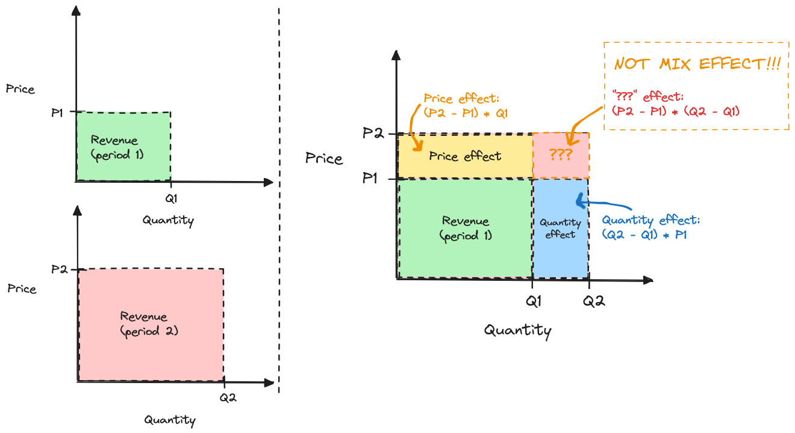

# Basic formulas and intuition

## Olist dataset

Throughout this book, I will be using [a dataset from Olist](https://www.kaggle.com/datasets/olistbr/brazilian-ecommerce), a Brazilian e-commerce company. Olist works as a platform e-marketplace, connecting businesses with consumers. It's like Etsy or Amazon, except Olist doesn't sell products or hold inventory. The dataset contains actual commercial data (anonymized) down to an order level - precisely the situation where PVM analysis excels. For each order, we know the customer, the seller, and the products, plus price and date information; products roll up into categories, while customers and sellers have associated geographical information.

Here's Olist financial performance on an aggregated level in 2017-2018:



::: {.callout-note}
The notebooks with all the calculations across the book are available in the appendix - if you prefer skimming the code in one place, you can do it there.
:::

Suppose we wanted to produce a breakdown of the 1.6M revenue increase to say how much was "due to volume" vs. "due to price." It's clear that most of the impact is due to volume - but how can we put a number to it?

## Basic intuition - hold the other factor constant

Well, already long back in the day [see @kirby1970variance], people figured out that the most intuitive way is to calculate the impact for one factor by holding the other factor constant:

* Price impact = [Change in price] * Quantity
* Quantity impact = [Change in Quantity] * Price

::: {.callout-tip}
## The single PVM principle
Indeed - the whole PVM framework is built on this single idea: hold the other factors constant. 

If this feels underwhelming - I am sorry! But if you keep this principle in mind, any PVM extension (constant currency analysis, mix effect decompositions, etc) should become much easier to reason about! It's all about holding the other factors constant.
:::

There's just one tricky question: which periods do _Quantity_ and _Price_ refer to, exactly?

Suppose we have data from two periods (1 and 2). Then, a change in price is simply $(\text{Price}_2 - \text{Price}_1)$, and change in quantity is $(\text{Quantity}_2 - \text{Quantity}_1)$. Intuitively, it "feels" like they should be multiplied with first-period counterparts, i.e., _Quantity_ is $\text{Quantity}_1$ and _Price_ is $\text{Price}_1$.

Unfortunately, when both prices & quantities change simultaneously, such formulas would not add up to the total change in revenue. Here's how it looks with olist data.



 That's not good - the whole point of PVM analysis is to decompose a KPI. It needs to add up. 

That leads us to the first point of contention in PVM analyses: formulas and naming conventions. 

I find it easiest to illustrate the exact issue geometrically.

## A Geometric PVM illustration 

We can think of revenue as represented by a rectangle's area, with price/quantity representing the two axes. Imagine we have two distinct periods, $T_1$ and $T_2$, and suppose that in $T_2$, price and quantity went up. Then, the rectangle representing revenue in $T_2$ overlaps with the rectangle representing revenue in $T_1$. The non-overlapping area is thus equal to the revenue increase, and we can decompose it into three parts:

 - Price effect: $(\text{Price}_2 - \text{Price}_1) * \text{Quantity}_1$: what was the impact of the change in prices holding quantity constant at $T_1$ value?
 - Quantity effect: $(\text{Quantity}_2 - \text{Quantity}_1) * \text{Price}_1$: what was the impact of the change in quantities holding price constant at $T_1$ value?
 - [yet to be named] effect: $(\text{Price}_2 - \text{Price}_1) * (\text{Quantity}_2 - \text{Quantity}_1)$: the "misbehaving part".
 
What is that pesky $(\text{Price}_2 - \text{Price}_1) * (\text{Quantity}_2 - \text{Quantity}_1)$ component? Well, it's just... maths  ¯\\_(ツ)_/¯. 

When both prices and volumes move together, the impact on revenue compounds. Imagine if we sold 100 units a dollar each in $T_1$, but now have increased quantity to 110 and prices to $1.1$. Not only do we get $0.1$ extra dollar for each of the initial 100 units sold, but we also gain $0.1$ on the incremental ten units. Similarly, increasing quantities by ten gives us not 1 dollar each, but $1.1$. 

::: {.callout-note}
## The non-intuitiveness of the 3rd effect
The previous example is pretty intuitive - but it's not always so. Consider what would happen if we swapped our data so that $T_1$ becomes $T_2$ and vice-versa (and thus we would see both prices and quantities going down). Price and quantity effects would be negative, but this component would be positive. 

Its interpretation would be "we didn't lose as much revenue due to prices going down because our quantities went down simultaneously (vs. a counterfactual scenario where only prices went down)". Imagine explaining that to an executive!
::: 

## Handling the 3rd component

You may be wondering how to name that 3rd component best. The most common way is not to. 

Instead, the typical PVM analysis will fully attribute it to the price or volume effect. By convention, it is included in the former, leading to the following formulas:

$$
\text{Price effect} = (\text{Price}_2 - \text{Price}_1) * \text{Quantity}_2
$$
$$ 
\text{Volume effect} = (\text{Quantity}_2 - \text{Quantity}_1) * \text{Price}_1
$$

We can now recalculate the impact that prices and volume had on Olist:



Typically, PVM analyses are presented as waterfall charts. While largely useless at this point, here is how we could visualize our calculations:



There are other ways to do it, and I will cover some alternatives I am aware of in @sec-alternative-formulas. Otherwise, this book will use the formulas above. For now, I want to call out one option: leaving this effect as a 3rd component and calling it __"mix"__.

You'd think it is not such a bad name: we have price, quantity, and mix (or mixed) variances. After all, the mix variance is affected by both prices and volumes simultaneously! The issue, however, is that in the PVM context, a "mix effect" typically refers to something very different. Instead of being a mathematical leftover, analysts refer to mix effects as quantifying how much an average price change was due to a shift in the volume mix of underlying units. 

Imagine you sell TVs and socks, and while you have not changed the prices of your products, you happen to increase the share of TVs sold. The average price of a product sold in your business will increase (unless you are into some really _premium_ socks and some really _low-end_ TVs). Mix effects typically refer to quantifying this change, and we'll dive into its calculations in @sec-mix-effects. 

That's why calling the 3rd component "mix" is typically a bad idea. If you prefer to keep it separate, call it a "joint effect", a "price and volume effect", or at least put a footnote under your analysis and explain what the effect represents.

::: {.callout-caution}
## Mix formulas, confusing naming conventions, and more
Not understanding what mix effects are is the #1 mistake I have seen among analysts using the PVM framework. It doesn't help that the internet is full of articles propagating wrong formulas taken from somewhere else without fully understanding what they are supposed to mean. 

You should _always_ ask one question when you see "mix effects" in a PVM analysis: __"Mix of what?"__. If the author of the analysis cannot explain what their mix effect represents - that's a huge red flag.
::: 

## Formula tweaks to account for new / discontinued items

One last thing about basic formulas, before we dive deeper, is handling new / discontinued items in a dataset. Conceptually, if we introduce a new product to a market at $T_2$, it would be logical to attribute all of its revenue to a quantity effect. Similarly, if we stop selling a product altogether, it would be logical that the entire revenue decline is also a quantity effect. In practice, formulas thus should contain an extra "if" clause to capture this logic:

$$
\text{Price effect} = 
\left\{ 
    \begin{array}{ c l }
    (\text{P}_2 - \text{P}_1) * \text{Q}_2 & \quad \textrm{if } \text{Q}_2 \ge 0 \text{ and } \text{Q}_1 \ge 0 \\
    0 & \quad \textrm{otherwise}
  \end{array}
\right.
$$

$$
\text{Volume effect} = 
\left\{ 
    \begin{array}{ c l }
    (\text{Q}_2 - \text{Q}_1) * \text{P}_1 & \quad \textrm{if } \text{Q}_2 \ge 0 \text{ and } \text{Q}_1 \ge 0 \\
    \text{Q}_2 * \text{P}_2 - \text{Q}_1 * \text{P}_1 & \quad \textrm{otherwise}
  \end{array}
\right.
$$ 
